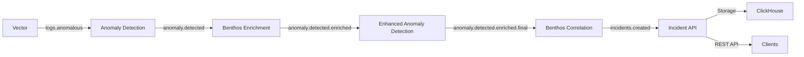

# Cruise AIOps Platform - Architecture Overview

## Table of Contents
- [High-Level Architecture](#high-level-architecture)
- [Sequential Event Processing Pipeline](#sequential-event-processing-pipeline)
- [Service Components](#service-components)
- [Data Flow](#data-flow)
- [AI/ML Integration](#aiml-integration)
- [Related Documentation](#related-documentation)

## High-Level Architecture

The Cruise AIOps Platform is built on an **offline-first, OSS-first** architecture designed for autonomous operation on cruise ships with intermittent satellite connectivity.

### Architecture Layers

```
┌─────────────────────────────────────────────────────────────┐
│                     UI & Visualization Layer                 │
│  Grafana OSS │ React Ops Console │ Keycloak SSO/RBAC       │
└─────────────────────────────────────────────────────────────┘
                            ↓
┌─────────────────────────────────────────────────────────────┐
│                   Application Services Layer                 │
│  Incident API │ Device Registry │ Link Health │ Remediation│
└─────────────────────────────────────────────────────────────┘
                            ↓
┌─────────────────────────────────────────────────────────────┐
│              Sequential Event Processing Pipeline            │
│  (See Sequential Pipeline Architecture section below)        │
└─────────────────────────────────────────────────────────────┘
                            ↓
┌─────────────────────────────────────────────────────────────┐
│                  Message Bus & Stream Processing             │
│         NATS JetStream │ Benthos Stream Processors          │
└─────────────────────────────────────────────────────────────┘
                            ↓
┌─────────────────────────────────────────────────────────────┐
│                   Data Storage & Retrieval                   │
│  ClickHouse (Logs) │ VictoriaMetrics (Metrics) │ Qdrant    │
└─────────────────────────────────────────────────────────────┘
                            ↓
┌─────────────────────────────────────────────────────────────┐
│                    Data Ingestion Layer                      │
│  Vector (Logs) │ Prometheus/VMAgent (Metrics) │ SNMP       │
└─────────────────────────────────────────────────────────────┘
```

## Sequential Event Processing Pipeline

**Design Document**: [Sequential Pipeline Architecture](sequential-pipeline-architecture.md)

The platform implements a modular, sequential event processing pipeline with strict separation of concerns and AI/ML integration at each stage.

### Pipeline Stages



### Stage Details

| Stage | Service | Port | Input Topic | Output Topic | Purpose |
|-------|---------|------|-------------|--------------|---------|
| 1 | Vector | 8686 | Syslog/Files | `logs.anomalous` | Log ingestion & filtering (ERROR/WARNING) |
| 2 | Anomaly Detection | 8080 | `logs.anomalous` | `anomaly.detected` | Basic anomaly detection with ML |
| 3 | Benthos Enrichment | 4196 | `anomaly.detected` | `anomaly.detected.enriched` | L1 context enrichment with LLM |
| 4 | Enhanced Anomaly | 9082 | `anomaly.detected.enriched` | `anomaly.detected.enriched.final` | L2 advanced grouping & analysis |
| 5 | Benthos Correlation | 4195 | `anomaly.detected.enriched.final` | `incidents.created` | Deduplication & incident formation |
| 6 | Incident API | 9081 | `incidents.created` | N/A | Storage (ClickHouse) & REST API |

### Key Design Principles

✅ **Sequential Processing**: Each stage subscribes to only one input topic and publishes to only one output topic  
✅ **Separation of Concerns**: Each service has a single, well-defined responsibility  
✅ **No Parallel Processing**: No two services consume the same NATS topic  
✅ **Separate Configurations**: Each Benthos service has its own YAML configuration  
✅ **AI/ML Integration**: LLM/Ollama integrated at enrichment, analysis, and correlation stages  
✅ **End-to-End Traceability**: Tracking IDs preserved throughout the entire pipeline  
✅ **Fallback Mechanisms**: Rule-based fallbacks when LLM/external services are unavailable  

### Testing the Pipeline

Run the end-to-end verification script:

```bash
./scripts/verify_modular_pipeline.sh
```

This script:
1. Verifies all services are healthy
2. Sends a test log message with tracking ID
3. Monitors the message through all pipeline stages
4. Verifies incident creation in ClickHouse
5. Provides detailed status for each stage

## Service Components

### Core Infrastructure

- **ClickHouse** (Port 8123): Log storage with MergeTree engine
- **VictoriaMetrics** (Port 8428): Time-series metrics storage
- **NATS** (Port 4222): Message bus with JetStream persistence
- **Grafana** (Port 3000): Dashboards and visualization
- **Keycloak** (Optional): SSO and RBAC

### Event Processing Services

- **Vector**: Log ingestion from syslog, files, and application logs
- **Anomaly Detection Service**: Rule-based and ML anomaly detection
- **Benthos Enrichment Service**: Maritime context, weather, and device registry integration
- **Enhanced Anomaly Detection Service**: Advanced grouping, historical analysis, LLM integration
- **Benthos Correlation Service**: Deduplication, suppression, incident formation with LLM
- **Incident API Service**: REST API and ClickHouse storage

### Application Services

- **Device Registry** (Port 8083): Ship and device inventory with hostname/IP tracking
- **Link Health Service** (Port 8082): Predictive satellite link degradation
- **Remediation Service**: Automated remediation with OPA policy enforcement
- **Onboarding Service** (Port 8090): Two-level approval workflow for deployments
- **Incident Explanation Service**: LLM-powered incident analysis
- **Network Device Collector** (Port 8088): SNMP-based network monitoring

### Supporting Services

- **OPA** (Port 8181): Policy enforcement for remediation actions
- **Ollama** (Port 11434): Local LLM inference
- **Qdrant** (Port 6333): Vector database for RAG
- **MailHog** (Port 8025): Email testing and local queue
- **VMAlert** (Port 8880): Alert rule evaluation
- **Alertmanager** (Port 9093): Alert routing and grouping

## Data Flow

### Metrics Flow

```
Physical Systems → Node Exporter → VMAgent → VictoriaMetrics → 
VMAlert (rules) → Alertmanager → MailHog/SMTP → 
Grafana (visualization)
```

### Logs Flow

```
Applications/Syslog → Vector → ClickHouse (logs.raw) +
                               ↓
                        NATS (logs.anomalous) → Sequential Pipeline →
                        Incidents (ClickHouse logs.incidents)
```

### Traces Flow (Optional)

```
Applications → OpenTelemetry Collector → Tempo/Jaeger →
Grafana (trace visualization)
```

### Network Monitoring Flow

```
Network Devices (SNMP) → Network Device Collector → 
NATS (telemetry.network.*) → VictoriaMetrics + ClickHouse
```

### Satellite Link Health Flow

```
VSAT Modem KPIs → Link Health Service (ML predictor) →
NATS (link.health.predictions) → VictoriaMetrics + Alerts
```

## AI/ML Integration

### LLM Integration Points

1. **Benthos Enrichment (L1)**
   - Maritime operational context analysis
   - Error pattern interpretation
   - Investigation guidance generation
   - Fallback: Rule-based context enrichment

2. **Enhanced Anomaly Detection (L2)**
   - Advanced anomaly grouping
   - Historical pattern correlation
   - Risk assessment and urgency determination
   - Fallback: Statistical analysis

3. **Benthos Correlation (Incident Formation)**
   - Root cause analysis
   - Runbook and remediation recommendations
   - Business impact assessment
   - Incident description generation
   - Fallback: Template-based incident creation

### ML Models

- **Anomaly Detection**: Statistical (Z-score, ESD, STL), Isolation Forest, LSTM
- **Link Health Prediction**: Time-series forecasting (Prophet, ARIMA, LSTM)
- **Capacity Forecasting**: Seasonal decomposition, trend analysis
- **Concept Drift Detection**: ADWIN, Page-Hinkley for threshold recalibration

### RAG (Retrieval-Augmented Generation)

- **Vector DB**: Qdrant stores embeddings of SOPs, configs, incident history
- **Embeddings**: BGE-M3 via sentence-transformers
- **LLM**: Ollama with Mistral 7B, Mixtral, or Qwen2 7B
- **Use Cases**: Incident explanation, runbook retrieval, context-aware recommendations

## Related Documentation

### Architecture & Design
- [Main Architecture](architecture.md) - Edge+Core offline-first design
- [Sequential Pipeline Architecture](sequential-pipeline-architecture.md) - Detailed event processing design
- [Modular Pipeline Architecture](modular-pipeline-architecture.md) - Dual processing architecture
- [Comprehensive Data Flow Diagram](comprehensive-data-flow-diagram.md) - Complete system data flows

### Configuration & Deployment
- [Quickstart Guide](quickstart.md) - Get started with Docker Compose
- [Quick Reference](quick-reference.md) - Command reference and access points
- [Vendor Configuration](configuration/vendor-config.md) - VSAT and device integration
- [Deployment Guides](deployment/) - Local, non-prod, and production deployment

### Features & Capabilities
- [v0.3 Features](v0.3-features.md) - Predictive link health + guarded remediation
- [Network Device Monitoring](network-device-monitoring-guide.md) - SNMP and network telemetry
- [Device Registry](device-registry-mapping-service.md) - Hostname and IP requirements
- [Onboarding Service](../services/onboarding-service/README.md) - Two-level approval workflow

### Testing & Validation
- [Testing Documentation](testing/) - Comprehensive test suites
- [Manual Testing Guide](validation/manual-testing-guide.md) - Step-by-step validation
- [CI/CD Pipeline](ci-cd-pipeline.md) - Automated testing and deployment

### Operations
- [Roadmap](roadmap.md) - Development milestones and features
- [Data Flow Guide](data-flow-guide.md) - Service interaction patterns
- [Incident Debugging](incident-data-debugging-guide.md) - Troubleshooting guide

## Quick Start

```bash
# Clone and setup
git clone https://github.com/iLodeStar/AIOps-NAAS.git
cd AIOps-NAAS
cp .env.example .env

# Start the stack
docker compose up -d

# Verify all services
docker compose ps

# Test sequential pipeline
./scripts/verify_modular_pipeline.sh

# Access Grafana
open http://localhost:3000  # admin/admin
```

## Support & Contributing

- **Issues**: [GitHub Issues](https://github.com/iLodeStar/AIOps-NAAS/issues)
- **Documentation**: See `docs/` directory
- **Tests**: Run `./scripts/verify_modular_pipeline.sh` for E2E validation

---

**Note**: This is an offline-first, OSS-first platform designed for autonomous operation. All components are open source with permissive licenses (Apache 2, MIT, AGPLv3). See [architecture.md](architecture.md) for license details.
