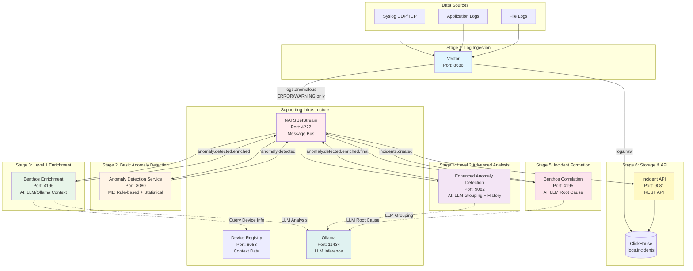
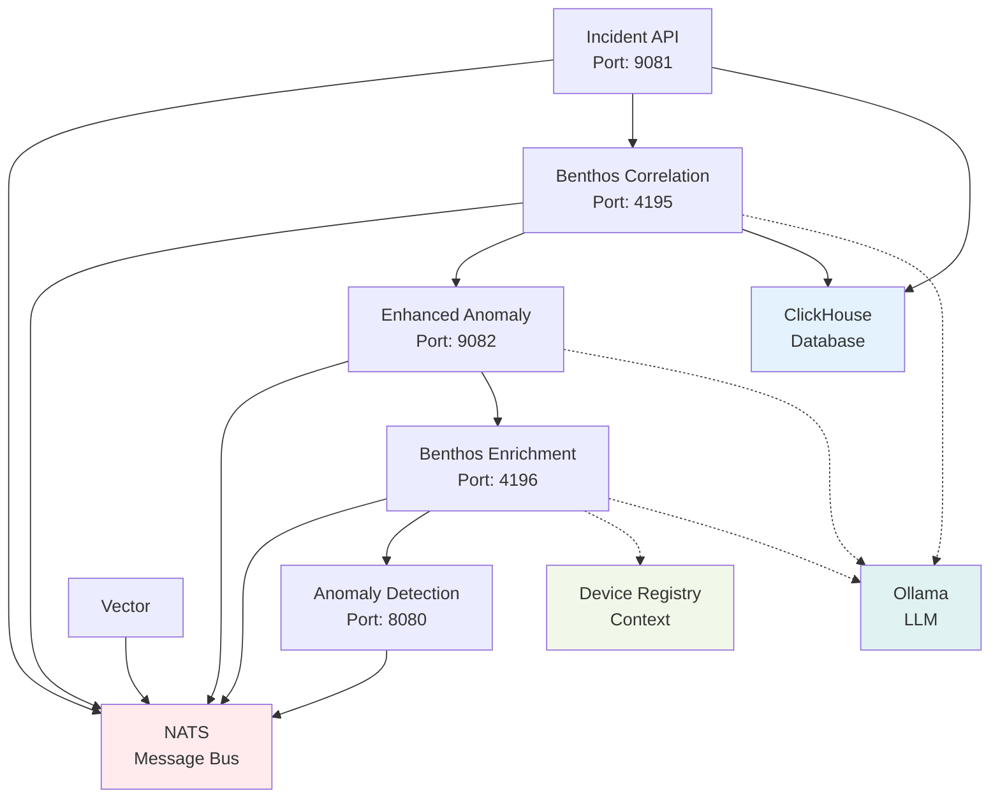
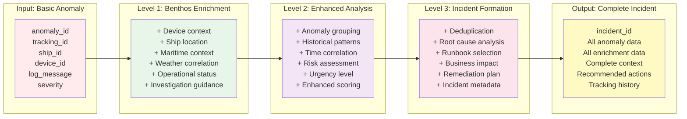
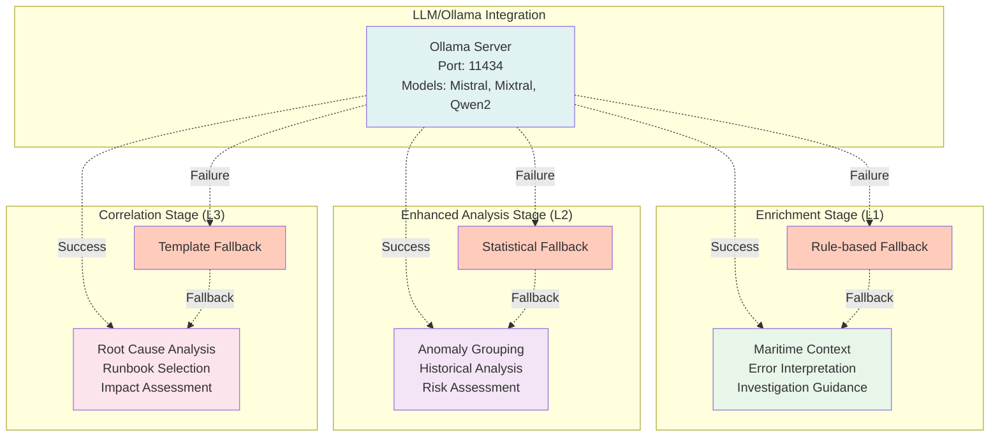

# Sequential Event Processing Pipeline - Visual Diagrams

## Complete Pipeline Flow



## NATS Topic Flow

```mermaid
graph LR
    subgraph "NATS Topics (Sequential)"
        T1[logs.anomalous]
        T2[anomaly.detected]
        T3[anomaly.detected.enriched]
        T4[anomaly.detected.enriched.final]
        T5[incidents.created]
    end
    
    S1[Vector] -->|Publish| T1
    T1 -->|Subscribe| S2[Anomaly Detection]
    S2 -->|Publish| T2
    T2 -->|Subscribe| S3[Benthos Enrichment]
    S3 -->|Publish| T3
    T3 -->|Subscribe| S4[Enhanced Anomaly]
    S4 -->|Publish| T4
    T4 -->|Subscribe| S5[Benthos Correlation]
    S5 -->|Publish| T5
    T5 -->|Subscribe| S6[Incident API]
    
    style T1 fill:#ffcdd2
    style T2 fill:#f8bbd0
    style T3 fill:#e1bee7
    style T4 fill:#d1c4e9
    style T5 fill:#c5cae9
```



## Service Dependency Chain



## Data Enrichment Flow



## AI/ML Integration Points



## Complete System Architecture

```
┌─────────────────────────────────────────────────────────────────┐
│                        Observability Layer                       │
│  Grafana (3000) │ Prometheus │ VictoriaMetrics │ ClickHouse UI │
└─────────────────────────────────────────────────────────────────┘
                                    ↓
┌─────────────────────────────────────────────────────────────────┐
│                     Application Services                         │
│  Device Registry │ Link Health │ Remediation │ Onboarding      │
│     (8083)       │    (8082)    │  (8084)     │   (8090)       │
└─────────────────────────────────────────────────────────────────┘
                                    ↓
┌─────────────────────────────────────────────────────────────────┐
│              Sequential Event Processing Pipeline                │
│                                                                  │
│  Vector → Anomaly Detection → Benthos Enrichment →             │
│  (8686)      (8080)              (4196)                         │
│                                                                  │
│  Enhanced Anomaly → Benthos Correlation → Incident API         │
│     (9082)             (4195)                (9081)            │
└─────────────────────────────────────────────────────────────────┘
                                    ↓
┌─────────────────────────────────────────────────────────────────┐
│                      Message Bus Layer                           │
│              NATS JetStream (4222, 8222)                        │
│  Topics: logs.anomalous → anomaly.detected →                   │
│          anomaly.detected.enriched →                            │
│          anomaly.detected.enriched.final →                      │
│          incidents.created                                      │
└─────────────────────────────────────────────────────────────────┘
                                    ↓
┌─────────────────────────────────────────────────────────────────┐
│                    Storage & AI/ML Layer                         │
│  ClickHouse (8123, 9000) │ VictoriaMetrics (8428)             │
│  Qdrant (6333)           │ Ollama (11434)                     │
└─────────────────────────────────────────────────────────────────┘
                                    ↓
┌─────────────────────────────────────────────────────────────────┐
│                       Data Sources                               │
│  Syslog │ Applications │ Network Devices │ VSAT Modems         │
└─────────────────────────────────────────────────────────────────┘
```

## Port Reference

| Service | Port | Protocol | Purpose |
|---------|------|----------|---------|
| **Pipeline Services** | | | |
| Vector | 8686 | HTTP | Metrics & health |
| Vector | 1514 | UDP | Syslog input |
| Anomaly Detection | 8080 | HTTP | Health & metrics |
| Benthos Enrichment | 4196 | HTTP | Ping & stats |
| Enhanced Anomaly | 9082 | HTTP | Health |
| Benthos Correlation | 4195 | HTTP | Ping & stats |
| Incident API | 9081 | HTTP | REST API |
| **Infrastructure** | | | |
| NATS | 4222 | NATS | Client connections |
| NATS Monitor | 8222 | HTTP | Monitoring |
| ClickHouse | 8123 | HTTP | Query interface |
| ClickHouse | 9000 | TCP | Native protocol |
| VictoriaMetrics | 8428 | HTTP | Query & write |
| Grafana | 3000 | HTTP | UI |
| Ollama | 11434 | HTTP | LLM API |
| Qdrant | 6333 | HTTP | Vector DB |
| **Application Services** | | | |
| Device Registry | 8083 | HTTP | REST API |
| Link Health | 8082 | HTTP | Predictions |
| Remediation | 8084 | HTTP | Automation |
| Onboarding | 8090 | HTTP | Workflow UI |

## Health Check Commands

```bash
# Pipeline Services
curl http://localhost:8686/health     # Vector
curl http://localhost:8080/health     # Anomaly Detection
curl http://localhost:4196/ping       # Benthos Enrichment
curl http://localhost:9082/health     # Enhanced Anomaly
curl http://localhost:4195/ping       # Benthos Correlation
curl http://localhost:9081/health     # Incident API

# Infrastructure
curl http://localhost:4222/healthz    # NATS
curl http://localhost:8222/varz       # NATS Monitor
curl http://localhost:8123/ping       # ClickHouse
curl http://localhost:8428/health     # VictoriaMetrics
curl http://localhost:3000/api/health # Grafana
curl http://localhost:11434/api/tags  # Ollama
curl http://localhost:6333/           # Qdrant
```

## Testing the Pipeline

### Quick Test
```bash
# Send test syslog message
echo "<11>$(date '+%b %d %H:%M:%S') ship-test app: ERROR TEST-$(uuidgen | cut -d'-' -f1) Test error message" | nc -u localhost 1514

# Wait for processing
sleep 30

# Check incident creation
curl http://localhost:9081/api/v1/incidents | jq
```

### Comprehensive Test
```bash
# Run full end-to-end verification
./scripts/verify_modular_pipeline.sh

# Expected output: 
# - All services healthy
# - Test message processed through all stages
# - Tracking ID preserved
# - Incident created in ClickHouse
# - REST API returns incident data
```

## Troubleshooting

### Check Service Logs
```bash
docker logs aiops-vector
docker logs aiops-anomaly-detection
docker logs aiops-benthos-enrichment
docker logs aiops-enhanced-anomaly-detection
docker logs aiops-benthos-correlation
docker logs aiops-incident-api
```

### Monitor NATS Topics
```bash
# View messages on each topic (requires nats CLI)
nats sub "logs.anomalous"
nats sub "anomaly.detected"
nats sub "anomaly.detected.enriched"
nats sub "anomaly.detected.enriched.final"
nats sub "incidents.created"
```

### Check ClickHouse Data
```bash
# Check raw logs
docker exec aiops-clickhouse clickhouse-client --query="SELECT count() FROM logs.raw"

# Check incidents
docker exec aiops-clickhouse clickhouse-client --query="SELECT * FROM logs.incidents ORDER BY created_at DESC LIMIT 5 FORMAT Pretty"
```

## References

- [Sequential Pipeline Architecture](sequential-pipeline-architecture.md) - Detailed design
- [Sequential Pipeline Validation](SEQUENTIAL_PIPELINE_VALIDATION.md) - Validation report
- [Architecture Overview](ARCHITECTURE_OVERVIEW.md) - Complete system architecture
- [Quick Reference](quick-reference.md) - Command reference

---

**Last Updated**: October 2, 2025  
**Architecture Version**: v1.0  
**Status**: Production Ready
