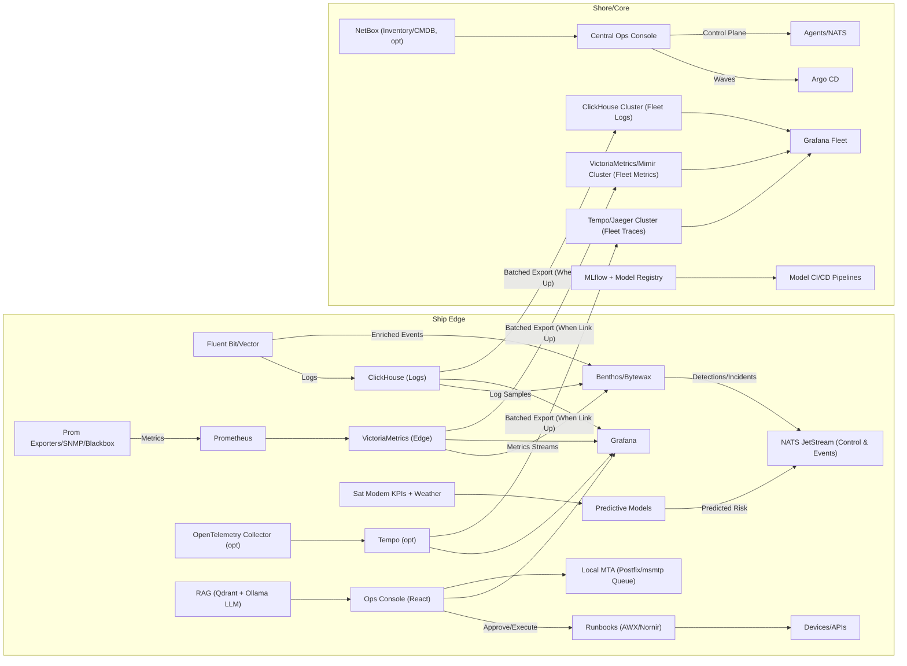

# Cruise AIOps Platform — Edge+Core Offline-First Architecture (OSS-First)

## Goals
- OSS-first and zero-license-fee stack; minimal operational cost.
- Autonomous shipboard operations with intermittent satellite backhaul.
- High-throughput ingest (>=100K events/sec), robust anomaly detection, predictive link health, and guarded auto-remediation.
- Rich LLM assistant with RAG over SOPs/configs/incident history.
- Centralized fleet reporting, control, and safe remote deployments.

## High-Level Diagram (Mermaid)

## Edge Components (Ship)
- Ingest
  - Logs: Fluent Bit (Apache 2) or Vector (MPL 2) -> ClickHouse (Apache 2).
  - Metrics: Prometheus + Node/Blackbox/SNMP exporters -> VictoriaMetrics single-binary (Apache 2).
  - Traces (optional): OpenTelemetry Collector -> Tempo (Apache 2).
  - Network data: sFlow/NetFlow collectors; LLDP topology; vendor APIs via Nornir/Netmiko.

- Transport and Stream Processing
  - NATS JetStream (Apache 2) for durable control/events bus (lightweight for ships).
  - Benthos (MIT) or Bytewax (Apache 2) for correlation, enrichment, rate-limiting, and incident formation.
  - Optional: Apache Kafka (Apache 2, KRaft mode) if you prefer Kafka; otherwise keep stack lean with NATS + direct writes to ClickHouse/VM.

- Analytics
  - Streaming anomaly detection (River + rules): Z-score/ESD/STL, Robust MAD, EWMA, Isolation Forest.
  - Forecasting: Prophet/ARIMA/statsmodels or LSTM/TFT as needed (PyTorch).
  - Concept drift detection: ADWIN/Page-Hinkley; automatic threshold recalibration.
  - Predictive link degradation: Features from modem (SNR, Es/No, BER), ship heading/GPS, weather. Outputs lead-time risk alerts.

- LLM + RAG
  - Ollama (MIT) to run local models.
  - Default OSS/Apache-2 models: Mistral 7B, Mixtral, Qwen2 7B. Optionally Llama 3.x (free license, not OSI).
  - Embeddings: BGE-M3 (MIT) via sentence-transformers.
  - Vector DB: Qdrant (Apache 2).
  - Tooling: LangChain or LlamaIndex for function-calling to ClickHouse/VM/Grafana and runbook retrieval.

- Auto-Remediation
  - AWX (GPLv3) + Nornir/Netmiko with pre-checks, dry-run, and rollback.
  - Open Policy Agent (Apache 2) to enforce guardrails, change windows, and blast-radius limits.

- UI
  - Grafana OSS (AGPLv3) for telemetry/alerts.
  - Ops Console (React/Next.js, MIT) for incidents, approvals, topology, inventory/licenses.
  - Keycloak (Apache 2) for SSO/RBAC.

- Email Alerts
  - Postfix or msmtp with durable local queue; priority and digesting; spools during outages and sends when backhaul is available.

- Deployment & Ops
  - k3s (Apache 2) cluster on ship.
  - Argo CD (Apache 2) GitOps; Harbor (Apache 2, optional) as on-ship registry cache; delta/resumable pulls.
  - Secrets via SOPS (MPL 2); mTLS and WireGuard (GPLv2) for management plane.

## Core Components (Shore)
- Storage & Analytics
  - ClickHouse cluster for long-term/fleet logs.
  - VictoriaMetrics or Grafana Mimir (AGPLv3) for fleet metrics.
  - Tempo/Jaeger for traces; S3-compatible object store for cold data.

- Replication
  - Batch exports from ClickHouse when satellite link is up.
  - VictoriaMetrics remote write/read windows; trace exports similarly.
  - NATS subjects bridged over VPN for low-volume control when possible.

- Fleet Control
  - Central Ops Console with fleet view; OpenStreetMap-based map of ships (self-hosted tiles).
  - Argo CD for wave-based, one-click, resumable deployments.
  - NetBox (Apache 2, optional) for inventory/licenses/EOL tracking.

- ML Platform
  - MLflow registry; retraining pipelines; shadow tests and staged promotion.

## Throughput & Sizing (Edge)
- Logs: 100K EPS achievable with Vector -> ClickHouse on 16–32 vCPU, 64–128 GB RAM, fast NVMe; use zstd compression and batched inserts.
- Metrics: VictoriaMetrics single-binary handles millions of samples/min; control cardinality via relabeling.
- Prefer NATS + direct TSDB/log sinks (fewer moving parts). Introduce Kafka only if a strong need arises.

## License Considerations
- Everything above is free and open source. Grafana OSS and Mimir are AGPLv3; ensure compliance if you modify/redistribute.
- LLM models: prefer Apache-2 (Mistral/Mixtral/Qwen2). If you choose Llama 3.x, validate Meta's license for your use-case.

## Differences from the RAG-Driven NaaS Assistant
- Adds offline-first streaming analytics, predictive RF models, and a control plane for safe automation.
- Uses lightweight, fully OSS components suited to ship hardware and intermittent connectivity.
- RAG is one layer; the platform provides end-to-end observability, correlation, forecasting, and guarded remediation.