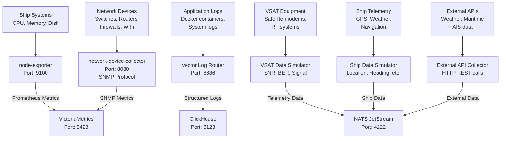
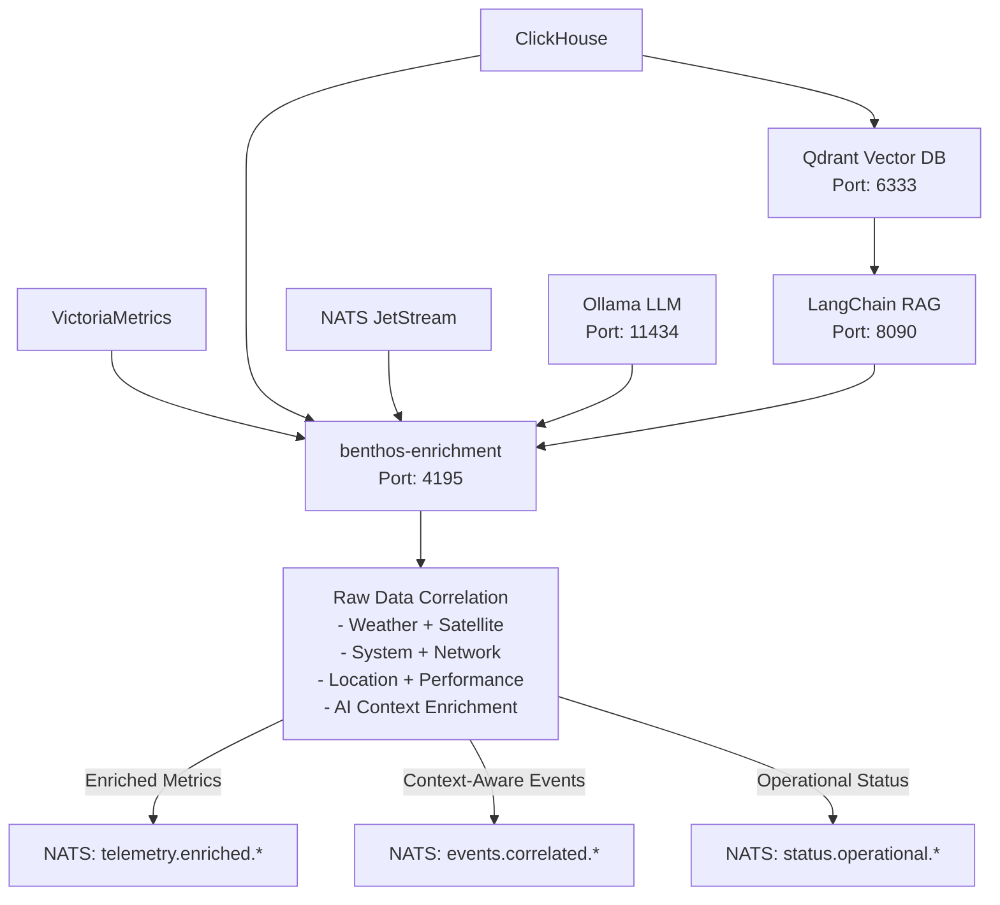
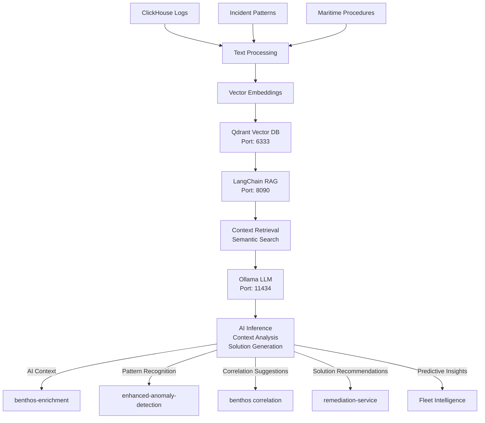
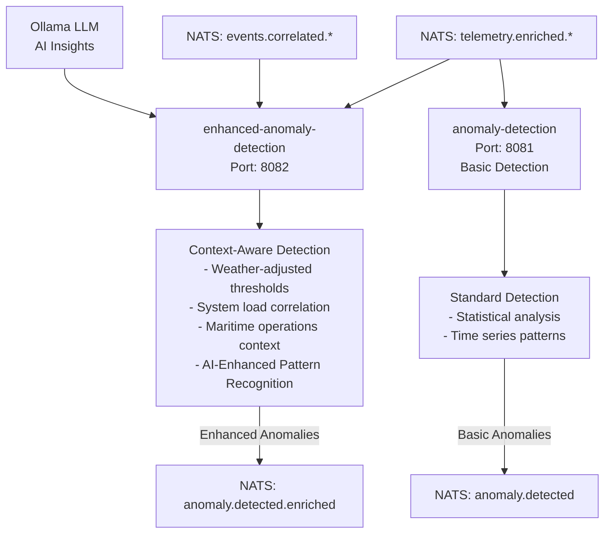
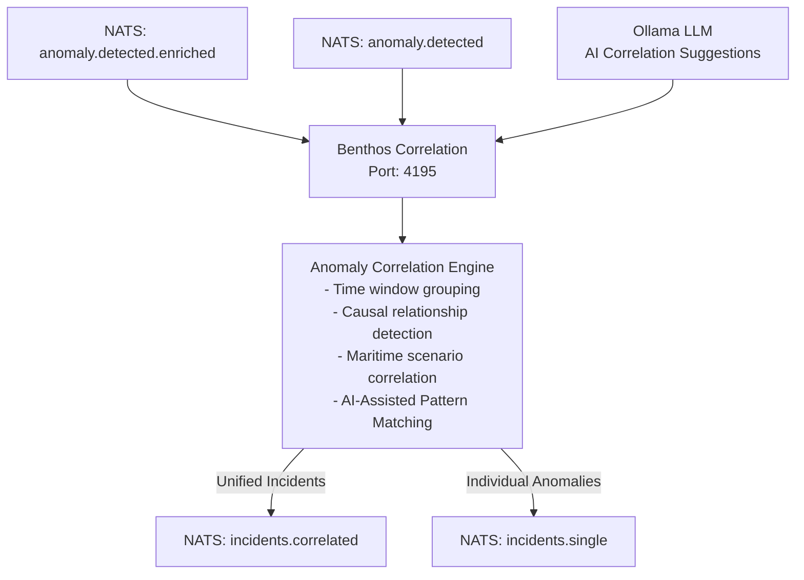
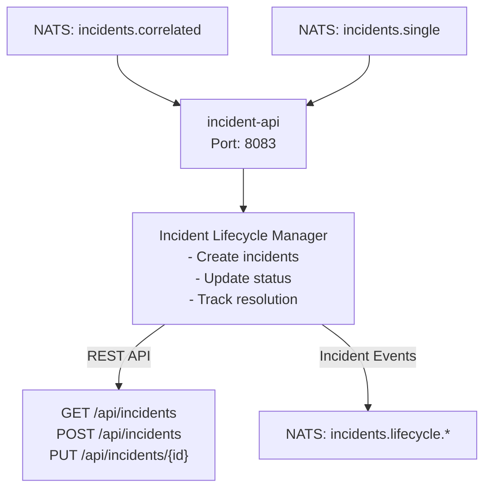
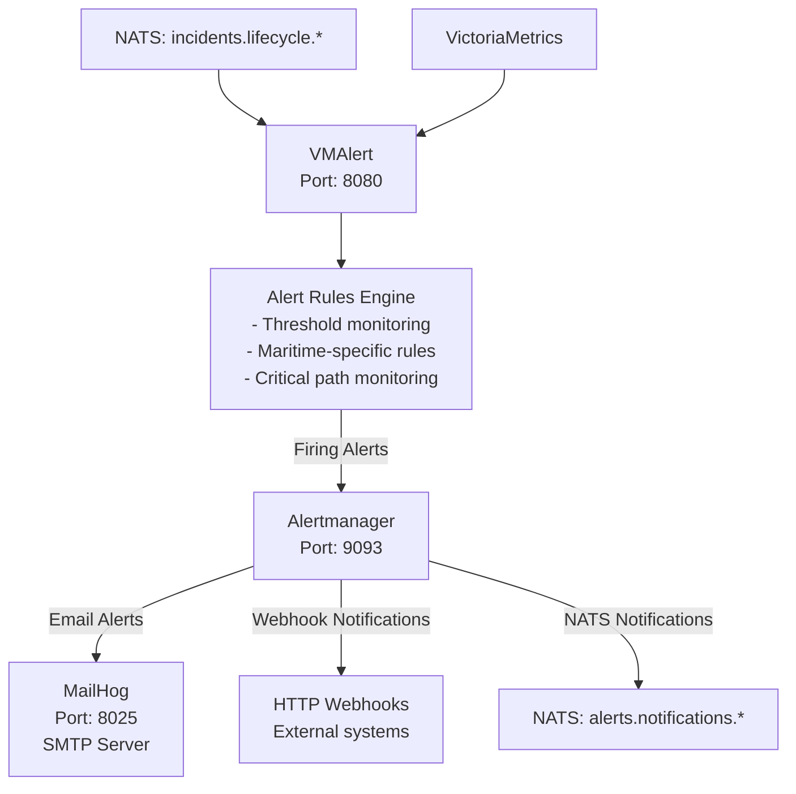
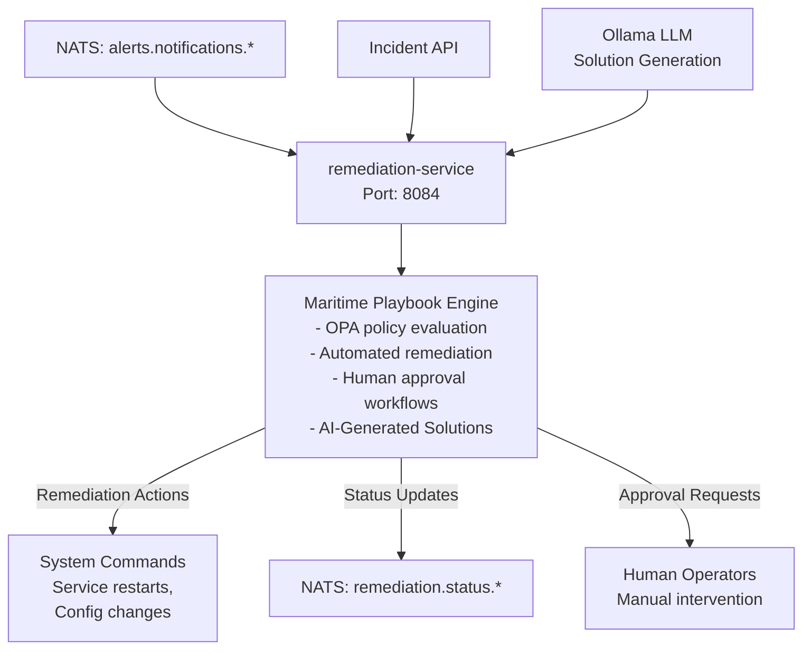
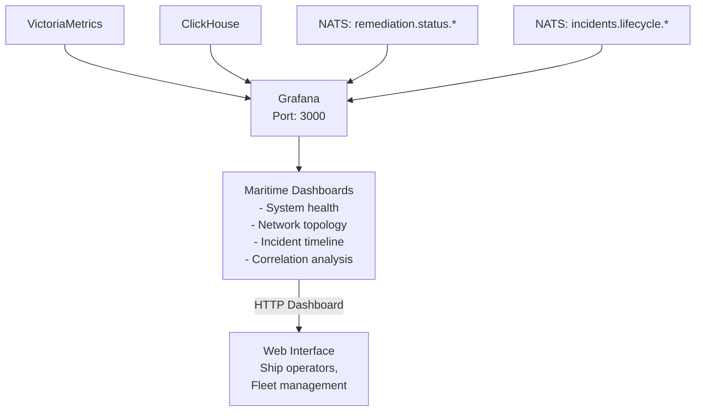
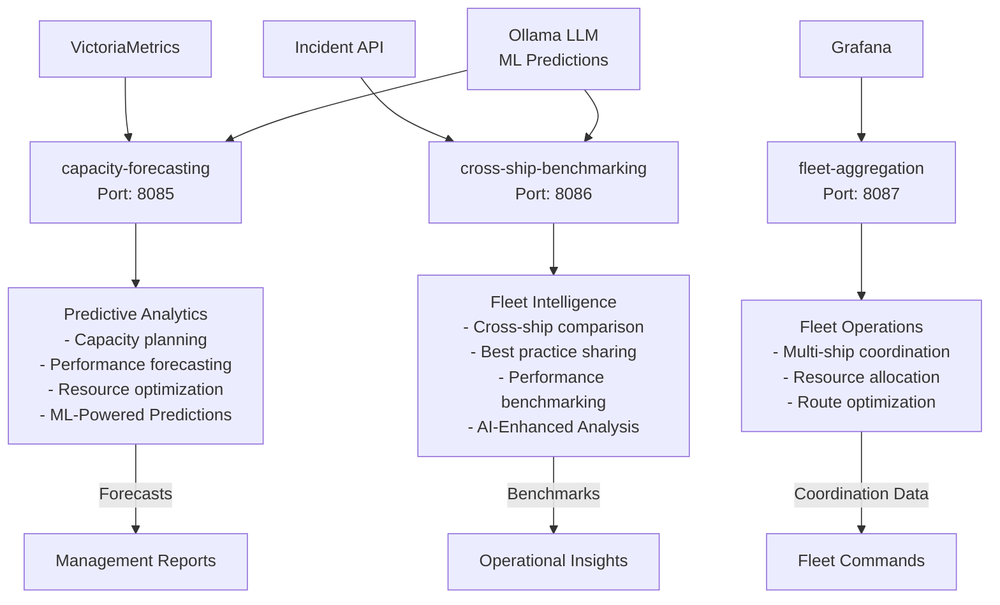

# Comprehensive Data Flow Diagram - AIOps NAAS Platform

This document shows the complete data flow architecture with input/output types for each service in the maritime AIOps platform.

## Network Device Data Collection Architecture

### How Network Device Data is Collected (SNMP)

**Critical Understanding**: We don't need to deploy code ON network devices (switches, bridges, firewalls, etc.). Instead, we use **SNMP (Simple Network Management Protocol)** which is a standard protocol that most network devices support natively.

**SNMP Data Collection Process:**
1. **No Code Deployment Required**: Network devices (switches, bridges, firewalls) come with SNMP enabled by default
2. **Remote Querying**: Our `network-device-collector` service queries devices remotely using SNMP OIDs (Object Identifiers)
3. **Standard Protocol**: SNMP is an industry-standard protocol - works with Cisco, Juniper, HP, Fortinet, etc.
4. **Configuration Only**: We only need to configure SNMP community strings (like "public" or "private") on the devices
5. **No Agent Installation**: The devices act as SNMP agents automatically - no software installation needed

**What Data We Collect via SNMP:**
- **Interface metrics**: Port utilization, error rates, packet counts
- **Device health**: CPU, memory, temperature, power supply status  
- **Network topology**: LLDP/CDP neighbor discovery
- **Vendor-specific data**: Using vendor MIBs (Management Information Bases)

---

## Complete Data Flow Architecture

### Level 1: Data Collection Layer



**Input/Output Summary - Data Collection:**
- **Input**: Raw telemetry from ships, network devices, applications, external sources
- **Output**: Structured metrics (VictoriaMetrics), logs (ClickHouse), streaming data (NATS)

### Level 2: Data Enrichment and Correlation (Level 1 Correlation)



**Input/Output Summary - Level 1 Enrichment:**
- **Input**: Raw metrics, logs, telemetry from storage systems + AI context
- **Output**: Enriched and correlated data streams with maritime context and AI insights

## AI/ML Integration Architecture

### AI/ML Stack Components

**Ollama LLM (Local Language Model)**
- **Port**: 11434
- **Function**: Local AI inference for context analysis, correlation suggestions, and solution generation
- **Integration Points**: Data enrichment, anomaly detection, correlation engine, remediation service
- **Maritime Context**: Understands ship operations, weather impacts, satellite communications

**Qdrant Vector Database**
- **Port**: 6333  
- **Function**: Stores vector embeddings of logs, incidents, and operational procedures
- **Integration Points**: Ingests from ClickHouse logs, serves LangChain RAG system
- **Maritime Context**: Maritime-specific embeddings for operational procedures and incident patterns

**LangChain RAG System**
- **Port**: 8090
- **Function**: Retrieval-Augmented Generation for contextual information retrieval
- **Integration Points**: Connects Qdrant with Ollama, enriches data streams with relevant context
- **Maritime Context**: Retrieves relevant maritime procedures, weather correlations, equipment documentation

### AI/ML Functions in Each Service

**Level 1 Enrichment (benthos-enrichment)**
- AI enhances raw data correlation with semantic understanding
- Ollama provides context about maritime operations based on current conditions
- RAG system retrieves relevant historical patterns for similar operational scenarios

**Anomaly Detection (enhanced-anomaly-detection)**  
- AI-enhanced pattern recognition beyond statistical thresholds
- Ollama analyzes anomaly context in maritime operational terms
- Semantic understanding of complex multi-system interactions

**Level 2 Correlation (benthos correlation)**
- AI suggests correlation patterns based on historical incident analysis
- Ollama provides natural language explanations of correlation reasoning
- Pattern matching enhanced with semantic understanding of maritime operations

**Remediation Service**
- AI generates solution recommendations based on incident context
- Ollama creates natural language explanations for recommended actions
- RAG retrieves relevant procedures from maritime operational documentation

**Fleet Intelligence Services**
- ML-powered predictive analytics for capacity and performance forecasting
- AI-enhanced cross-ship benchmarking with contextual analysis
- Semantic analysis of operational patterns across fleet

### AI Data Flow



### AI/ML Value Proposition

**Enhanced Context Understanding**
- Natural language processing of maritime operational context
- Semantic understanding of relationships between weather, satellite, and system performance
- Historical pattern recognition for similar operational scenarios

**Intelligent Correlation**
- AI identifies non-obvious correlations between disparate system events
- Semantic clustering of related anomalies into meaningful operational incidents
- Context-aware incident classification with maritime operational understanding

**Proactive Remediation** 
- AI generates contextual solution recommendations based on historical success patterns
- Natural language explanations help operators understand recommended actions
- Learning from successful and failed remediation attempts

**Fleet-Wide Intelligence**
- Cross-ship pattern analysis for fleet-wide operational insights
- Predictive modeling enhanced with semantic understanding of operational context
- AI-powered benchmarking with contextual analysis of performance differences

### Level 3: Anomaly Detection


```

**Input/Output Summary - Anomaly Detection:**
- **Input**: Enriched telemetry and correlated events
- **Output**: Anomaly events (basic and context-aware)

### Level 4: Anomaly Correlation (Level 2 Correlation)



**Input/Output Summary - Level 2 Correlation:**
- **Input**: Individual anomaly events (basic and enriched)
- **Output**: Correlated incident groups and individual incidents

### Level 5: Incident Management



**Input/Output Summary - Incident Management:**
- **Input**: Correlated and individual incidents from NATS
- **Output**: REST API for incident CRUD, lifecycle events

### Level 6: Alerting and Notification



**Input/Output Summary - Alerting:**
- **Input**: Incident lifecycle events and metrics
- **Output**: Email alerts, webhooks, notification streams

### Level 7: Remediation and Automation



**Input/Output Summary - Remediation:**
- **Input**: Alert notifications and incident data
- **Output**: Automated remediation actions, status updates, approval requests

### Level 8: Monitoring and Visualization



**Input/Output Summary - Monitoring:**
- **Input**: Metrics, logs, incident data, remediation status
- **Output**: Interactive dashboards and visualizations

### Level 9: Intelligence and Analytics



**Input/Output Summary - Intelligence:**
- **Input**: Historical metrics, incident patterns, fleet data
- **Output**: Forecasts, benchmarks, operational intelligence

---

## Complete Data Flow Summary

### Primary Data Flow Path:
1. **Raw Collection**: Ship systems → Collectors → Storage (VictoriaMetrics/ClickHouse/NATS)
2. **Level 1 Enrichment**: Storage → benthos-enrichment → Correlated telemetry streams
3. **Anomaly Detection**: Enriched data → Detection services → Anomaly events
4. **Level 2 Correlation**: Anomaly events → Benthos correlation → Unified incidents  
5. **Incident Management**: Incidents → incident-api → REST API + lifecycle tracking
6. **Alerting**: Incidents → VMAlert → Alertmanager → Notifications (email/webhook)
7. **Remediation**: Alerts → remediation-service → Automated actions + approvals
8. **Visualization**: All data → Grafana → Maritime operational dashboards
9. **Intelligence**: Historical data → Analytics services → Predictive insights

### Key Integration Points:
- **NATS JetStream**: Primary message bus for all real-time data
- **VictoriaMetrics**: Time-series metrics storage and querying
- **ClickHouse**: Log storage and analytical queries  
- **Grafana**: Unified visualization of all data sources
- **REST APIs**: External integration and manual operations

### Maritime-Specific Features:
- **Environmental Context**: Weather correlation with network performance
- **Critical Path Monitoring**: Satellite and navigation system prioritization
- **Ship Operations Integration**: Location, heading, operational mode awareness
- **Fleet Coordination**: Cross-ship data sharing and benchmarking
- **Offline Resilience**: Local processing with shore synchronization

This architecture provides complete observability and automated operations for maritime environments with comprehensive network infrastructure monitoring.