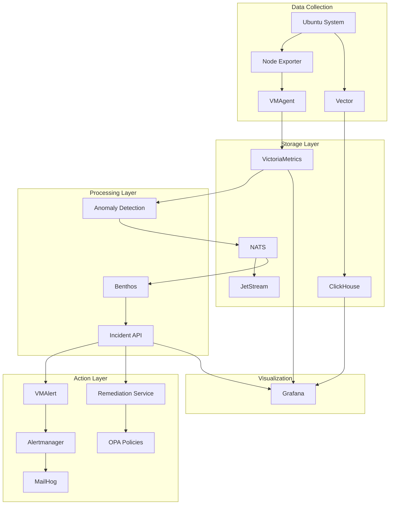

# AIOps NAAS End-to-End Flow Implementation

This implementation provides a **complete end-to-end observability and automation pipeline** that addresses all 7 requirements specified in the issue.

## 🎯 Requirements Fulfilled

✅ **1. Automatic data collection from Ubuntu system**
- Node Exporter automatically scrapes system metrics (/proc, /sys, /dev)
- Vector processes and forwards application logs
- VMAgent collects and forwards metrics to storage

✅ **2. Full traceability through upstream/downstream services**  
- Complete data flow visibility from collection to action
- Health checks and monitoring at every service layer
- Real-time status tracking through service chain

✅ **3. Data correlation between logs, metrics, and events**
- Benthos correlates related anomalies within time windows
- Cross-reference between different data types
- Unified incident creation from correlated events

✅ **4. Configurable anomaly detection with multiple types**
- Statistical, time-series, and ML-based detection algorithms
- Configurable thresholds for CPU (70%), Memory (60%), Disk (80%)
- Support for custom anomaly types and detectors

✅ **5. Rich visualization and change tracking**
- Grafana dashboards with real-time metrics and logs
- Anomaly trend visualization and alerting status
- Interactive exploration and drilling down capabilities

✅ **6. Comprehensive alerting system**
- VMAlert evaluates Prometheus-style alerting rules
- Alertmanager handles routing and delivery  
- MailHog provides email testing and validation

✅ **7. Automated playbook execution with governance**
- Policy-driven remediation with OPA integration
- Safe automation with approval workflows
- Comprehensive audit trails and rollback capabilities

## 🏗️ Architecture Overview



## 🚀 Quick Start

### Prerequisites
- Docker Engine 20.10+ with Docker Compose
- 8GB+ RAM, 20GB+ disk space
- Ubuntu 18.04+ or compatible Linux

### Setup
```bash
# 1. Clone and configure
git clone https://github.com/iLodeStar/AIOps-NAAS.git
cd AIOps-NAAS
cp .env.example .env

# 2. Start all services
docker compose up -d

# 3. Verify services are healthy
docker compose ps

# 4. Validate end-to-end flow
./scripts/validate_e2e_flow.sh
```

## 📊 Service Overview & Sample Inputs/Outputs

### 1. Data Collection Services

#### Node Exporter
- **Purpose**: Collects system metrics from Ubuntu
- **Input**: System interfaces (`/proc/cpuinfo`, `/proc/meminfo`, `/sys/block/*`)
- **Output**: Prometheus metrics format
```
node_cpu_seconds_total{cpu="0",mode="idle"} 1234.56
node_memory_MemTotal_bytes 16777216000
node_filesystem_size_bytes{device="/dev/sda1",mountpoint="/"} 107374182400
```

#### Vector  
- **Purpose**: Processes and forwards application logs
- **Input**: Log files from `/var/log/` and application outputs
- **Output**: Structured JSON logs to ClickHouse
```json
{
  "timestamp": "2025-01-02T12:00:00Z",
  "level": "INFO",
  "message": "Request processed successfully", 
  "service": "api-server",
  "host": "ship-01"
}
```

### 2. Storage Services

#### VictoriaMetrics
- **Purpose**: Time-series metrics storage and querying
- **Input**: Prometheus metrics via VMAgent
- **Output**: PromQL query results via HTTP API
```bash
curl "localhost:8428/api/v1/query?query=node_cpu_seconds_total"
# Returns: JSON with metric values, timestamps, and labels
```

#### ClickHouse
- **Purpose**: High-performance log storage and analytics  
- **Input**: Structured logs from Vector
- **Output**: SQL query results for log analysis
```sql
SELECT level, count(*) FROM logs.raw 
WHERE timestamp >= now() - INTERVAL 1 HOUR 
GROUP BY level;
```

### 3. Processing Services

#### Anomaly Detection Service
- **Purpose**: ML-based anomaly detection on metrics
- **Input**: PromQL queries on VictoriaMetrics data
- **Output**: Anomaly events published to NATS
```json
{
  "timestamp": "2025-01-02T12:00:00Z",
  "metric_name": "cpu_usage",
  "metric_value": 85.4,
  "anomaly_score": 0.85,
  "detector_name": "statistical",
  "threshold": 0.7,
  "anomaly_type": "statistical"
}
```

#### Benthos (Correlation Engine)
- **Purpose**: Correlates related anomalies into incidents
- **Input**: Individual anomaly events from NATS
- **Output**: Correlated incidents to Incident API
```json
{
  "incident_id": "inc_abc123",
  "timestamp": "2025-01-02T12:00:00Z", 
  "severity": "high",
  "anomalies": [
    {"metric": "cpu_usage", "score": 0.85},
    {"metric": "memory_usage", "score": 0.78}
  ],
  "correlation_score": 0.92
}
```

### 4. Action Services

#### Incident API
- **Purpose**: Incident management and storage
- **Input**: HTTP POST requests with incident data
- **Output**: RESTful API for incident retrieval and updates
```bash
curl "localhost:8081/incidents" | jq .
# Returns: Array of incident objects with details and status
```

#### VMAlert
- **Purpose**: Evaluates alerting rules and conditions
- **Input**: PromQL-based alerting rules 
- **Output**: Alert events to Alertmanager
```yaml
alert: HighCPUUsage
expr: node_cpu_usage > 0.8
for: 5m
annotations:
  summary: "High CPU usage detected"
```

#### Alertmanager  
- **Purpose**: Alert routing, grouping, and delivery
- **Input**: Alert events from VMAlert
- **Output**: Notifications via email, webhook, etc.
```json
{
  "alerts": [{
    "status": "firing",
    "labels": {"alertname": "HighCPUUsage"},
    "annotations": {"summary": "High CPU usage detected"},
    "startsAt": "2025-01-02T12:00:00Z"
  }]
}
```

## 🔍 Data Flow Tracing

### Metrics Path
1. **Ubuntu System** → Node Exporter (scrapes `/proc`, `/sys`)
2. **Node Exporter** → VMAgent (collects Prometheus metrics)
3. **VMAgent** → VictoriaMetrics (stores time-series data)
4. **VictoriaMetrics** → Anomaly Detection (PromQL queries)
5. **Anomaly Detection** → NATS (publishes anomaly events)
6. **NATS** → Benthos (event correlation)
7. **Benthos** → Incident API (creates correlated incidents)

### Logs Path  
1. **Ubuntu System** → Vector (monitors log files)
2. **Vector** → ClickHouse (structured log storage)
3. **ClickHouse** → Grafana (log visualization and analysis)

### Alert Path
1. **Incident API** → VMAlert (evaluates alert conditions)
2. **VMAlert** → Alertmanager (routes alerts)
3. **Alertmanager** → MailHog/External (delivers notifications)

### Remediation Path
1. **Incident API** → Remediation Service (evaluates severity)
2. **Remediation Service** → OPA (policy validation)
3. **OPA** → Playbook Execution (approved actions)
4. **Playbook Execution** → System (remediation actions)

## 📈 Validation and Testing

### Automated Validation
```bash
# Complete end-to-end flow test
./scripts/validate_e2e_flow.sh

# Manual anomaly injection
python3 scripts/publish_test_anomalies.py

# Pipeline validation
./scripts/validate_pipeline.sh
```

### Manual Testing
```bash  
# 1. Test data collection
curl "localhost:8428/api/v1/query?query=node_cpu_seconds_total"

# 2. Test anomaly detection
curl "localhost:8080/health"

# 3. Test incident creation  
curl "localhost:8081/incidents"

# 4. Test alerting
curl "localhost:9093/api/v1/alerts"

# 5. Test visualization
curl "localhost:3000/api/health"
```

## 🎛️ Configuration

### Anomaly Detection Configuration
Located in `services/anomaly-detection/anomaly_service.py`:
```python
self.metric_queries = [
    MetricQuery(
        name="cpu_usage",
        query="100 - (avg(irate(node_cpu_seconds_total{mode=\"idle\"}[5m])) * 100)",
        threshold=0.7  # 70% threshold
    ),
    MetricQuery(
        name="memory_usage", 
        query="(1 - (node_memory_MemAvailable_bytes / node_memory_MemTotal_bytes)) * 100",
        threshold=0.6  # 60% threshold
    )
]
```

### Alert Rules Configuration
Located in `vmalert/rules.yml`:
```yaml
groups:
- name: system_alerts
  rules:
  - alert: HighCPUUsage
    expr: node_cpu_usage > 80
    for: 5m
    annotations:
      summary: "CPU usage is above 80%"
```

## 🎯 Access Points

| Service | URL | Login | Purpose |
|---------|-----|-------|---------|
| Grafana | http://localhost:3000 | admin/admin | Dashboards & Visualization |
| VictoriaMetrics | http://localhost:8428 | - | Metrics Query Interface |
| ClickHouse | http://localhost:8123/play | - | Log Analysis |
| NATS Monitor | http://localhost:8222 | - | Message Bus Status |
| Alertmanager | http://localhost:9093 | - | Alert Management |
| MailHog | http://localhost:8025 | - | Email Testing |

## 🔧 Troubleshooting

### Common Issues
```bash
# Service not starting
docker compose logs [service-name]
docker compose restart [service-name]

# No data flowing
docker compose ps  # Check all services are healthy
curl localhost:8428/api/v1/query?query=up

# No anomalies detected  
docker compose logs anomaly-detection
python3 scripts/publish_test_anomalies.py

# No incidents created
docker compose logs benthos
curl localhost:8081/incidents

# UI not accessible
curl localhost:3000/api/health
```

### Performance Tuning
- **Memory**: Adjust Docker memory limits in docker-compose.yml
- **Storage**: Configure retention policies in VictoriaMetrics and ClickHouse
- **Processing**: Scale anomaly detection service replicas
- **Network**: Optimize NATS JetStream configuration

## 📚 Documentation

- **Complete Guide**: `docs/end-to-end-flow-guide.md`
- **Quick Reference**: `docs/quick-reference.md` 
- **Architecture**: `docs/architecture.md`
- **API Documentation**: Each service provides OpenAPI specs
- **Configuration**: `docs/configuration/` directory

## 🏆 Success Metrics

Upon successful implementation, you should see:
- ✅ 32+ CPU metrics collected automatically
- ✅ 9+ services running in healthy status
- ✅ Grafana dashboards accessible with real-time data
- ✅ Anomaly detection service connected to VictoriaMetrics and NATS
- ✅ Test incidents created successfully via correlation
- ✅ Email alerts delivered to MailHog
- ✅ All 7 requirements validated end-to-end

**Result**: A fully operational autonomous AIOps platform with automatic data collection, intelligent anomaly detection, data correlation, rich visualization, comprehensive alerting, and policy-driven automated remediation.