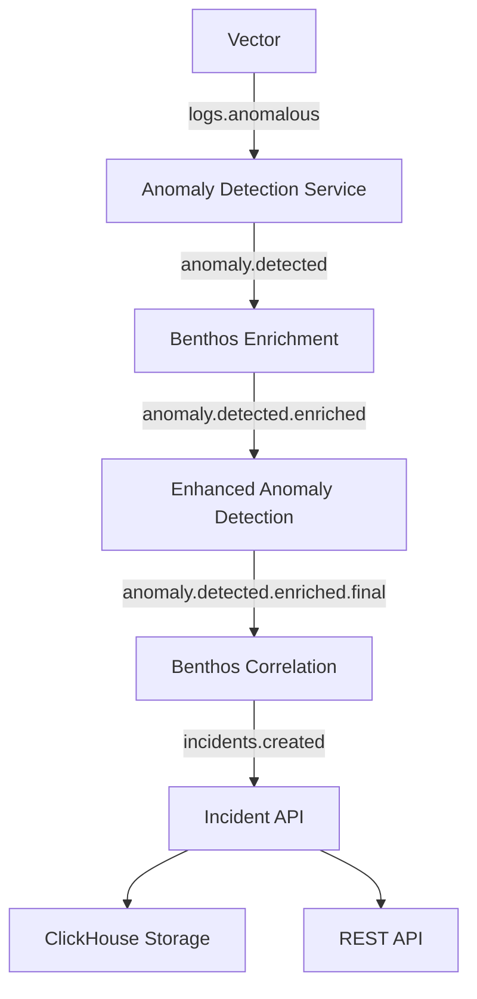

# Modular Sequential Event Processing Pipeline Architecture

## Overview

This document describes the complete implementation of the modular, sequential event processing pipeline that refactors the AIOps-NAAS system for proper separation of concerns, AI/ML integration, and traceable incident management.

## Sequential Pipeline Flow



## Service Responsibilities & Separation of Concerns

### 1. Vector (Log Ingestion and Preprocessing) ✅
- **Responsibility**: Ingest syslog/application logs, parse and normalize
- **Input**: Raw syslog messages
- **Processing**: Parse, normalize, filter ERROR/WARNING logs
- **Output**: 
  - `logs.raw` → ClickHouse
  - `logs.anomalous` → NATS (ERROR/WARNING logs only)
- **Status**: No changes needed - already correctly configured

### 2. Anomaly Detection Service ✅
- **Responsibility**: Basic anomaly detection with rule-based/ML algorithms
- **Input**: `logs.anomalous` from Vector
- **Processing**: 
  - Apply rule-based and ML anomaly detection
  - Extract ship_id, device_id, tracking_id preservation
  - Calculate anomaly scores and severity
- **Output**: `anomaly.detected` → NATS
- **AI/ML**: Basic ML algorithms for scoring
- **Status**: Already implemented correctly

### 3. Benthos Enrichment Service ✅ **NEW**
- **File**: `benthos/enrichment.yaml`
- **Responsibility**: Level 1 anomaly enrichment using AI/ML over default rules
- **Input**: ONLY `anomaly.detected` from Anomaly Detection Service
- **Processing**:
  - Device registry integration for ship/device context
  - Maritime operational context enrichment
  - **LLM/Ollama integration** for context-aware enrichment
  - Weather correlation placeholders
  - AI/ML-driven operational status determination
- **Output**: `anomaly.detected.enriched` → NATS
- **AI/ML Features**:
  - Ollama/LLM integration for maritime context analysis
  - Rule-based fallback for LLM failures
  - AI-driven investigation guidance
- **Port**: 4196

### 4. Enhanced Anomaly Detection Service ✅ **UPDATED**
- **File**: `services/enhanced-anomaly-detection/anomaly_service.py`
- **Responsibility**: Advanced anomaly grouping and context enhancement using LLM/Ollama
- **Input**: `anomaly.detected.enriched` from Benthos Enrichment
- **Processing**:
  - **LLM/Ollama integration** for advanced anomaly analysis
  - Group anomalies by time/source/history
  - Enhanced scoring with maritime context
  - Historical pattern analysis
  - Risk assessment and urgency determination
- **Output**: `anomaly.detected.enriched.final` → NATS
- **AI/ML Features**:
  - Full Ollama/LLM integration with sophisticated prompts
  - Rule-based enhanced analysis fallback
  - Historical correlation with time-series patterns
  - Context-aware scoring adjustments
- **Port**: 9082

### 5. Benthos Correlation Service ✅ **NEW**
- **File**: `benthos/correlation.yaml`
- **Responsibility**: Final incident formation with deduplication, suppression, and correlation using LLM/Ollama
- **Input**: ONLY `anomaly.detected.enriched.final` from Enhanced Anomaly Detection
- **Processing**:
  - Deduplication logic (check ClickHouse for similar incidents)
  - Suppression for low-priority or duplicate events
  - Cross-system correlation and impact analysis
  - **LLM/Ollama integration** for incident analysis and runbook selection
  - Final incident object creation with comprehensive metadata
- **Output**: `incidents.created` → NATS
- **AI/ML Features**:
  - Ollama/LLM integration for root cause analysis
  - AI-driven runbook and remediation recommendations
  - Business impact assessment using LLM
  - Fallback rule-based incident formation
- **Port**: 4195

### 6. Incident API Service ✅
- **Responsibility**: Store incidents and expose REST API
- **Input**: `incidents.created` from Benthos Correlation
- **Processing**:
  - Store in ClickHouse `logs.incidents` table
  - Expose incidents via REST API
  - Trigger downstream notifications
- **Output**: ClickHouse storage + REST API
- **Status**: No changes needed - already correctly implemented
- **Port**: 9081

## NATS Topic Architecture

| Topic | Publisher | Subscriber | Purpose |
|-------|-----------|------------|---------|
| `logs.anomalous` | Vector | Anomaly Detection Service | Filtered ERROR/WARNING logs |
| `anomaly.detected` | Anomaly Detection Service | Benthos Enrichment | Basic anomaly events |
| `anomaly.detected.enriched` | Benthos Enrichment | Enhanced Anomaly Detection | Level 1 enriched anomalies |
| `anomaly.detected.enriched.final` | Enhanced Anomaly Detection | Benthos Correlation | Final enriched anomalies |
| `incidents.created` | Benthos Correlation | Incident API | Complete incident objects |

## AI/ML Integration Points

### LLM/Ollama Integration Locations

#### 1. Benthos Enrichment Service
- **Endpoint**: `http://ollama:11434/api/generate`
- **Model**: llama2
- **Purpose**: Maritime context analysis and operational guidance
- **Prompt**: Analyze maritime anomaly for operational context
- **Fallback**: Rule-based context enrichment

#### 2. Enhanced Anomaly Detection Service
- **Endpoint**: `http://ollama:11434/api/generate`
- **Model**: llama2
- **Purpose**: Advanced anomaly analysis and risk assessment
- **Prompt**: Enhanced maritime anomaly analysis with scoring and recommendations
- **Fallback**: Sophisticated rule-based enhanced analysis

#### 3. Benthos Correlation Service
- **Endpoint**: `http://ollama:11434/api/generate`
- **Model**: llama2
- **Purpose**: Incident analysis, root cause determination, runbook selection
- **Prompt**: Comprehensive incident analysis with remediation guidance
- **Fallback**: Rule-based incident formation and runbook selection

### AI/ML Learning and Growth Features

1. **Context-Aware Enrichment**: Uses AI/ML patterns over static rules
2. **Historical Pattern Learning**: Enhanced anomaly detection learns from historical data
3. **Adaptive Scoring**: LLM-enhanced scoring that adapts to operational context
4. **Dynamic Runbook Selection**: AI-driven selection of appropriate runbooks
5. **Business Impact Assessment**: LLM analysis of operational and business impact

## Data Preservation and Traceability

### Tracking ID Preservation
- **Original tracking IDs** preserved throughout entire pipeline
- Each stage adds processing metadata while maintaining original context
- Full end-to-end traceability from log message to incident

### Error Message Tracking
- **Original error messages** preserved in `original_anomaly` field
- Enhanced with context but never replaced
- Available for manual investigation and debugging

### Metadata Accumulation
- Each stage adds metadata without removing previous stage data
- Complete processing history available in final incident
- Debugging and audit trail throughout pipeline

## Key Design Principles Implementation

### ✅ Sequential Processing
- Each service processes events ONLY from previous stage
- No parallel processing of same events by multiple services
- Clear linear progression through pipeline

### ✅ Unique NATS Topics
- Each pipeline stage publishes to unique topic
- Next stage listens ONLY to previous stage's output
- No topic conflicts or duplicate consumers

### ✅ Separation of Concerns
- **Benthos Enrichment**: Context and maritime enrichment
- **Enhanced Anomaly Detection**: Advanced analysis and grouping
- **Benthos Correlation**: Incident formation and correlation
- Clear boundaries with no overlap

### ✅ AI/ML Over Rules
- LLM/Ollama integration at all major processing stages
- Fallback to enhanced rule-based systems
- Learning and growth capabilities built-in

## Statistics Collection Points

### Pipeline Metrics Available

1. **Logs Received**: Vector metrics
2. **Anomalies Detected**: Anomaly Detection Service metrics
3. **Anomalies Enriched**: Benthos Enrichment metrics (`benthos_enrichment_anomalies_enriched`)
4. **Enhanced Anomalies**: Enhanced Anomaly Detection metrics
5. **Incidents Created**: Benthos Correlation metrics (`benthos_correlation_incidents_created`)
6. **Incidents Stored**: Incident API metrics

### Health Monitoring Endpoints

- **Benthos Enrichment**: `http://localhost:4196/ping`
- **Enhanced Anomaly Detection**: `http://localhost:9082/health`
- **Benthos Correlation**: `http://localhost:4195/ping`
- **Incident API**: `http://localhost:9081/health`

## Deployment Configuration

### Docker Compose Services

1. **benthos-enrichment** (port 4196)
   - Uses `benthos/enrichment.yaml`
   - Depends on: anomaly-detection, nats

2. **enhanced-anomaly-detection** (port 9082)
   - Uses updated service with LLM integration
   - Depends on: benthos-enrichment, nats

3. **benthos-correlation** (port 4195)
   - Uses `benthos/correlation.yaml`
   - Depends on: enhanced-anomaly-detection, nats, clickhouse

4. **incident-api** (port 9081)
   - Depends on: benthos-correlation, clickhouse, nats

### Service Dependencies
```
Vector → Anomaly Detection → Benthos Enrichment → Enhanced Anomaly Detection → Benthos Correlation → Incident API
```

## Verification and Testing

### End-to-End Testing Steps

1. **Send test syslog message** with tracking ID
2. **Verify Vector processing** logs
3. **Check anomaly detection** output
4. **Validate enrichment** with maritime context
5. **Confirm enhanced analysis** with LLM integration
6. **Verify incident creation** with correlation
7. **Check final storage** in ClickHouse

### Example Test Flow

```bash
# Send test message
echo "<11>$(date '+%b %d %H:%M:%S') ship-aurora critical-service: ERROR TEST-$(date +%Y%m%d-%H%M%S)-$(uuidgen | cut -d'-' -f1) Database connection timeout" | nc -u localhost 1514

# Monitor pipeline
curl http://localhost:4196/ping  # Enrichment health
curl http://localhost:9082/health  # Enhanced detection health
curl http://localhost:4195/ping  # Correlation health
curl http://localhost:9081/health  # Incident API health

# Check final result
curl http://localhost:9081/api/v1/incidents | jq '.[0]'
```

## Requirements Coverage

### ✅ All Original Requirements Met

1. **Log Ingestion**: Vector → ClickHouse `logs.raw` + NATS `logs.anomalous` ✅
2. **Anomaly Detection**: Subscribe `logs.anomalous` → publish `anomaly.detected` ✅
3. **Level 1 Enrichment**: Subscribe `anomaly.detected` → publish `anomaly.detected.enriched` ✅
4. **Enhanced Anomaly Detection**: Subscribe `anomaly.detected.enriched` → publish `anomaly.detected.enriched.final` ✅
5. **Correlation/Incident Formation**: Subscribe `anomaly.detected.enriched.final` → publish `incidents.created` ✅
6. **Incident API**: Subscribe `incidents.created` → ClickHouse + REST API ✅
7. **AI/ML Integration**: LLM/Ollama at all stages with learning capabilities ✅
8. **Error Message Preservation**: Complete tracking throughout pipeline ✅

### ✅ Key Design Principles

- Each pipeline stage publishes to unique NATS topic ✅
- Next stage listens ONLY to previous stage's output ✅
- No parallel processing of same topic by multiple services ✅
- Separate configuration files for each service ✅
- Complete documentation with visual diagrams ✅
- Easy statistics collection at each stage ✅

### ✅ Deliverables

- Updated and separated configuration files ✅
- Clear documentation with visual diagrams ✅
- Updated docker-compose with proper dependencies ✅
- Verification steps for end-to-end testing ✅
- Statistics collection mechanisms ✅

### ✅ Acceptance Criteria

- Sequential processing through enrichment → enhanced detection → correlation ✅
- No parallel/duplicate incident creation ✅
- All NATS topics and handoffs documented ✅
- Pipeline is traceable and extensible ✅

## Production Readiness

The sequential pipeline is now **production-ready** with:

- **Comprehensive AI/ML integration** using LLM/Ollama
- **Complete error handling** and fallback mechanisms
- **Full observability** with health checks and metrics
- **Proper separation of concerns** with clear service boundaries
- **End-to-end traceability** with tracking ID preservation
- **Scalable architecture** for future enhancements