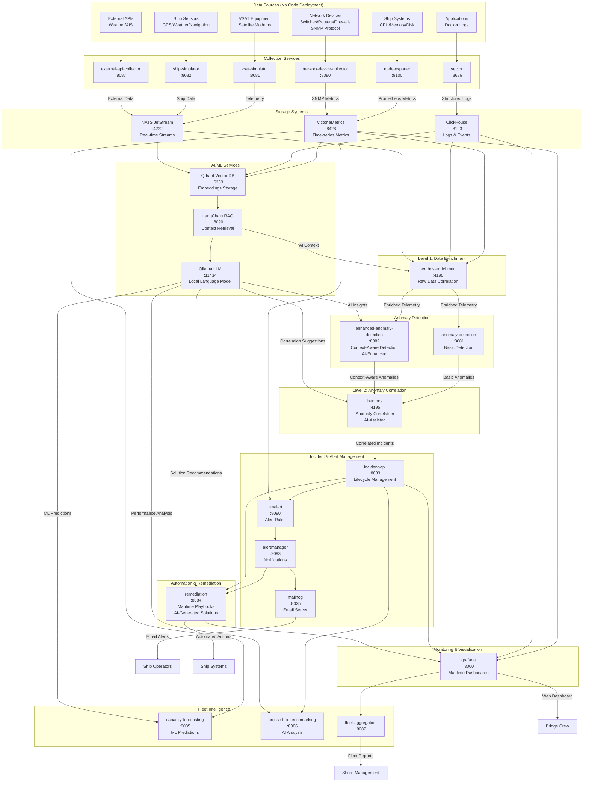
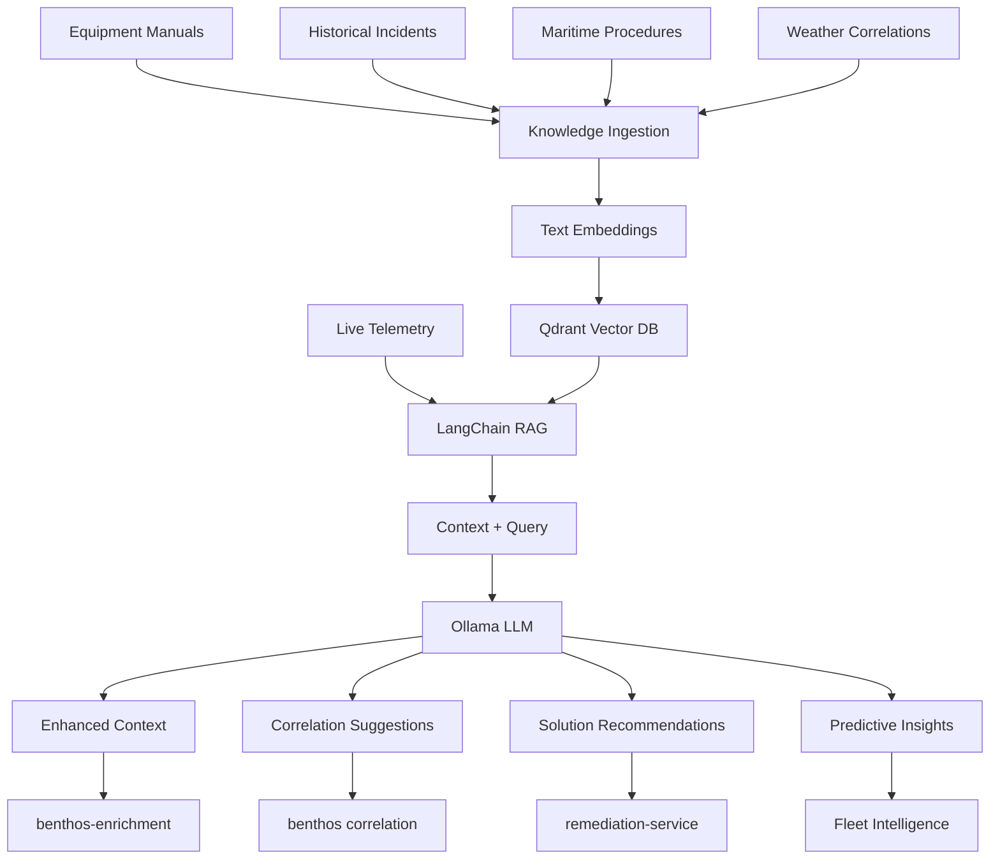

# Maritime AIOps Platform - Service Data Flow Architecture

## Complete Service Input/Output Map

## Key Service Functions

### Data Collection Layer
| Service | Input | Output | Protocol |
|---------|--------|--------|----------|
| node-exporter | Ship system metrics | Prometheus metrics | HTTP scraping |
| network-device-collector | Network devices | SNMP metrics | SNMP v2c/v3 |
| vector | Application logs | Structured logs | File tailing, Docker API |
| Data simulators | VSAT/Ship telemetry | Simulated data | Internal generation |

### Storage & Messaging
| Service | Input | Output | Purpose |
|---------|--------|--------|---------|
| VictoriaMetrics | Prometheus metrics | Time-series queries | Metrics storage |
| ClickHouse | Structured logs | SQL queries | Log analytics |
| NATS JetStream | Real-time events | Message streams | Event streaming |

### AI/ML Services
| Service | Input | Output | Function |
|---------|--------|--------|---------|
| Ollama LLM | Query prompts + context | Text responses, insights | Local language model inference |
| Qdrant Vector DB | Text embeddings | Vector similarity search | Semantic search for logs/docs |
| LangChain RAG | Raw data + embeddings | Contextual information | Retrieval-Augmented Generation |

### Processing & Correlation  
| Service | Input | Output | Function |
|---------|--------|--------|---------|
| benthos-enrichment | Raw metrics/logs/telemetry + AI context | Enriched data streams | Level 1 correlation with AI insights |
| anomaly-detection | Enriched telemetry | Anomaly events | Pattern detection |
| enhanced-anomaly-detection | Enriched + context + AI insights | Context-aware anomalies | Maritime-aware detection with ML |
| benthos correlation | Anomaly events + AI suggestions | Correlated incidents | Level 2 correlation with AI assistance |

### Operations & Response
| Service | Input | Output | Function |
|---------|--------|--------|---------|
| incident-api | Incident events | REST API, lifecycle events | Incident management |
| vmalert | Metrics + incidents | Alert rules evaluation | Alert generation |
| alertmanager | Alert events | Email, webhooks | Notification routing |
| remediation | Alerts + incidents + AI recommendations | Automated actions | Maritime playbooks with AI-generated solutions |

### Intelligence & Visualization
| Service | Input | Output | Function |
|---------|--------|--------|---------|
| grafana | All data sources | Web dashboards | Unified visualization |
| capacity-forecasting | Historical metrics + ML models | Capacity predictions | ML-powered resource planning |
| cross-ship-benchmarking | Incident data + AI analysis | Performance comparisons | AI-enhanced fleet optimization |
| fleet-aggregation | Multi-ship data | Fleet coordination | Operations intelligence |

## Network Device Data Collection (SNMP)

**Critical Point**: We collect network device data via **SNMP (Simple Network Management Protocol)** - no code deployment on devices required.

### How SNMP Works:
1. **Native Support**: Switches, routers, firewalls support SNMP out-of-the-box
2. **Remote Queries**: Our `network-device-collector` queries devices over the network
3. **Standard OIDs**: Uses industry-standard Object Identifiers for metrics
4. **Vendor MIBs**: Supports vendor-specific Management Information Bases
5. **Configuration Only**: Requires only SNMP community string configuration on devices

### Data Collected via SNMP:
- **Interface Metrics**: Utilization, error rates, packet counts
- **Device Health**: CPU, memory, temperature, power status
- **Network Topology**: LLDP/CDP neighbor discovery
- **Security Stats**: Firewall connection counts, throughput
- **Environmental**: Device temperature, humidity, power quality

### Supported Devices:
- **Switches**: Cisco Catalyst, HP/Aruba, Juniper EX
- **Routers**: Cisco ISR, Juniper MX  
- **Firewalls**: Fortinet FortiGate, Palo Alto, SonicWall
- **WiFi**: Controllers and access points
- **Maritime Equipment**: VSAT modems, satellite terminals
- **Support Systems**: NAS, UPS, environmental sensors

This architecture provides comprehensive maritime network monitoring without requiring software deployment on individual network devices.

## AI/ML Integration Points

### How AI Enhances the Maritime AIOps Platform

**Ollama Local LLM (Port: 11434)**
- **Context Analysis**: Understands maritime operational context (weather, satellite, ship position)
- **Pattern Recognition**: Identifies complex relationships between system events
- **Solution Generation**: Creates contextual remediation recommendations
- **Natural Language Processing**: Converts technical metrics into operational insights

**Qdrant Vector Database (Port: 6333)**  
- **Semantic Search**: Vector embeddings of logs, incidents, and procedures
- **Pattern Matching**: Historical incident pattern recognition
- **Maritime Knowledge**: Stores maritime-specific operational knowledge vectors
- **Context Retrieval**: Retrieves relevant context for correlation and remediation

**LangChain RAG System (Port: 8090)**
- **Knowledge Retrieval**: Connects stored knowledge with current incidents
- **Context Enrichment**: Adds relevant historical context to current events  
- **Procedure Lookup**: Retrieves relevant maritime operational procedures
- **Documentation Integration**: Incorporates equipment manuals and best practices

### AI Enhancement by Service Layer

**Data Enrichment Layer**
- AI enriches raw telemetry with semantic context about maritime operations
- Understands relationships between weather conditions and satellite performance
- Provides operational context (normal operations vs. storm conditions vs. port arrival)

**Anomaly Detection Layer**
- AI-enhanced pattern recognition beyond statistical thresholds
- Semantic understanding of complex multi-system maritime scenarios
- Context-aware anomaly classification (weather-related vs. equipment failure vs. operational)

**Correlation Layer**
- AI suggests correlation patterns based on maritime operational knowledge
- Semantic clustering of related anomalies into operational incidents
- Natural language explanations of correlation reasoning

**Remediation Layer**  
- AI generates contextual solution recommendations based on maritime best practices
- Learning from historical remediation success/failure patterns
- Natural language explanations help operators understand recommended actions

**Intelligence Layer**
- ML-powered predictive analytics for capacity and performance forecasting
- AI-enhanced fleet benchmarking with operational context awareness
- Semantic analysis of operational patterns across maritime environments

### AI Data Processing Flow

This AI integration transforms the platform from reactive monitoring into proactive maritime operational intelligence.