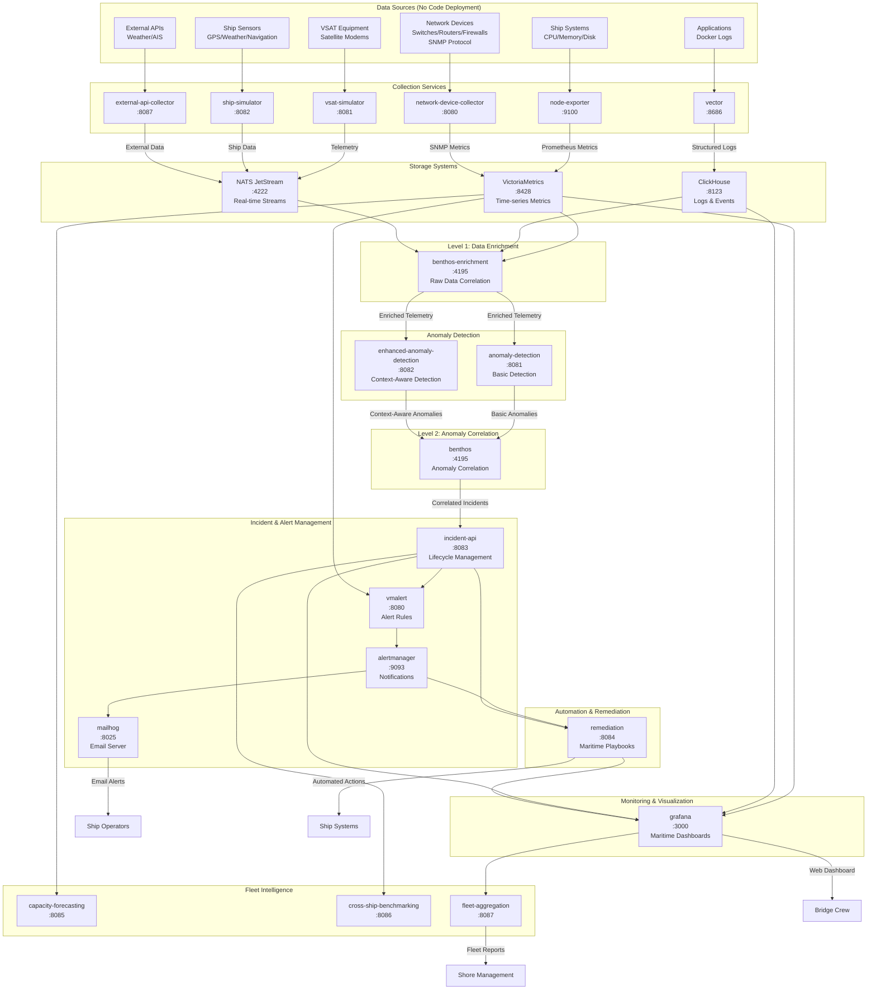

# Maritime AIOps Platform - Service Data Flow Architecture

## Complete Service Input/Output Map

## Key Service Functions

### Data Collection Layer
| Service | Input | Output | Protocol |
|---------|--------|--------|----------|
| node-exporter | Ship system metrics | Prometheus metrics | HTTP scraping |
| network-device-collector | Network devices | SNMP metrics | SNMP v2c/v3 |
| vector | Application logs | Structured logs | File tailing, Docker API |
| Data simulators | VSAT/Ship telemetry | Simulated data | Internal generation |

### Storage & Messaging
| Service | Input | Output | Purpose |
|---------|--------|--------|---------|
| VictoriaMetrics | Prometheus metrics | Time-series queries | Metrics storage |
| ClickHouse | Structured logs | SQL queries | Log analytics |
| NATS JetStream | Real-time events | Message streams | Event streaming |

### Processing & Correlation
| Service | Input | Output | Function |
|---------|--------|--------|---------|
| benthos-enrichment | Raw metrics/logs/telemetry | Enriched data streams | Level 1 correlation |
| anomaly-detection | Enriched telemetry | Anomaly events | Pattern detection |
| enhanced-anomaly-detection | Enriched + context | Context-aware anomalies | Maritime-aware detection |
| benthos correlation | Anomaly events | Correlated incidents | Level 2 correlation |

### Operations & Response
| Service | Input | Output | Function |
|---------|--------|--------|---------|
| incident-api | Incident events | REST API, lifecycle events | Incident management |
| vmalert | Metrics + incidents | Alert rules evaluation | Alert generation |
| alertmanager | Alert events | Email, webhooks | Notification routing |
| remediation | Alerts + incidents | Automated actions | Maritime playbooks |

### Intelligence & Visualization
| Service | Input | Output | Function |
|---------|--------|--------|---------|
| grafana | All data sources | Web dashboards | Unified visualization |
| capacity-forecasting | Historical metrics | Capacity predictions | Resource planning |
| cross-ship-benchmarking | Incident data | Performance comparisons | Fleet optimization |
| fleet-aggregation | Multi-ship data | Fleet coordination | Operations intelligence |

## Network Device Data Collection (SNMP)

**Critical Point**: We collect network device data via **SNMP (Simple Network Management Protocol)** - no code deployment on devices required.

### How SNMP Works:
1. **Native Support**: Switches, routers, firewalls support SNMP out-of-the-box
2. **Remote Queries**: Our `network-device-collector` queries devices over the network
3. **Standard OIDs**: Uses industry-standard Object Identifiers for metrics
4. **Vendor MIBs**: Supports vendor-specific Management Information Bases
5. **Configuration Only**: Requires only SNMP community string configuration on devices

### Data Collected via SNMP:
- **Interface Metrics**: Utilization, error rates, packet counts
- **Device Health**: CPU, memory, temperature, power status
- **Network Topology**: LLDP/CDP neighbor discovery
- **Security Stats**: Firewall connection counts, throughput
- **Environmental**: Device temperature, humidity, power quality

### Supported Devices:
- **Switches**: Cisco Catalyst, HP/Aruba, Juniper EX
- **Routers**: Cisco ISR, Juniper MX  
- **Firewalls**: Fortinet FortiGate, Palo Alto, SonicWall
- **WiFi**: Controllers and access points
- **Maritime Equipment**: VSAT modems, satellite terminals
- **Support Systems**: NAS, UPS, environmental sensors

This architecture provides comprehensive maritime network monitoring without requiring software deployment on individual network devices.